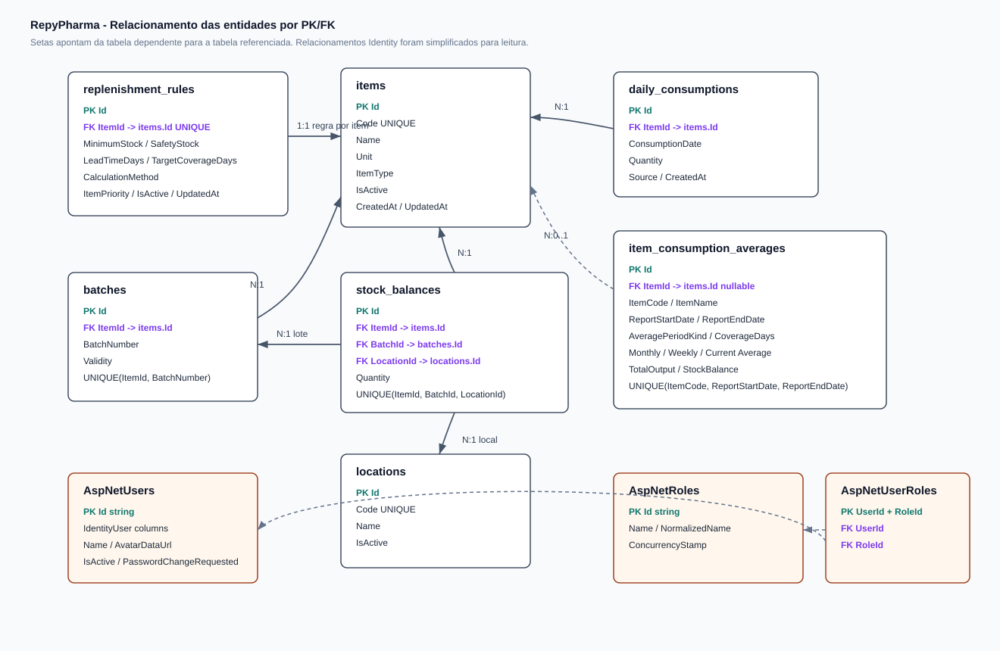

# Documentação do Banco de Dados do RepyPharma

Esta documentação descreve o modelo de dados configurado em `Data/AppDbContext.cs` e nas entidades de `Domain/Entities`. O banco usa PostgreSQL via Entity Framework Core e também inclui as tabelas padrão do ASP.NET Identity para autenticação.

## Diagrama de Relacionamento

O diagrama acima mostra as entidades principais do domínio e as relações por chave primária/chave estrangeira. As tabelas do ASP.NET Identity foram simplificadas para mostrar apenas a relação central entre usuários e perfis.

## Visão Geral do Modelo

O modelo foi desenhado ao redor de uma decisão central: separar cadastro do item, lote, localização e saldo. Essa separação evita duplicação e permite representar corretamente a realidade do estoque hospitalar, onde o mesmo item pode existir em vários lotes e o mesmo lote pode ter quantidades diferentes em diferentes setores.

As entidades principais são:

- `items`: cadastro mestre dos produtos/insumos.
- `batches`: lotes de cada item.
- `locations`: setores/locais de estoque.
- `stock_balances`: saldo de um item, em um lote, em uma localização.
- `daily_consumptions`: histórico granular de consumo diário.
- `item_consumption_averages`: médias importadas de relatórios PDF.
- `replenishment_rules`: regra de reposição e estoque mínimo por item.
- `AspNetUsers` e tabelas Identity: autenticação, autorização e preferências básicas do usuário.

## Entidades do Domínio

### `items`

Representa o cadastro central de cada medicamento ou material.

Campos principais:

- `Id`: chave primária inteira.
- `Code`: código externo do item; é obrigatório, tem tamanho máximo de 50 e índice único.
- `Name`: nome do item; obrigatório, máximo de 255.
- `Unit`: unidade de medida; obrigatória, máximo de 100.
- `ItemType`: tipo do item, armazenado como inteiro.
- `IsActive`: indica se o item ainda está ativo no estoque importado.
- `CreatedAt` e `UpdatedAt`: auditoria simples de criação/alteração.

Relacionamentos:

- 1:N com `batches`.
- 1:N com `stock_balances`.
- 1:N com `daily_consumptions`.
- 1:N com `item_consumption_averages`, com `ItemId` opcional do lado das médias.
- 1:1 com `replenishment_rules`.

Motivo do desenho:

`items` é a raiz do domínio de estoque. Manter o item separado dos lotes e saldos permite atualizar nome, unidade, tipo e status do produto uma única vez, mesmo quando ele aparece em vários lotes ou setores.

### `batches`

Representa um lote específico de um item.

Campos principais:

- `Id`: chave primária.
- `ItemId`: chave estrangeira para `items.Id`.
- `BatchNumber`: número do lote; obrigatório, máximo de 100.
- `Validity`: validade do lote.
- `CreatedAt` e `UpdatedAt`: auditoria simples.

Restrições:

- Índice único em `(ItemId, BatchNumber)`.

Relacionamentos:

- N:1 com `items`.
- 1:N com `stock_balances`.

Motivo do desenho:

O número do lote não é globalmente único com garantia suficiente; por isso a unicidade é composta por item e número do lote. Isso permite rastrear validade e disponibilidade por lote, requisito importante para reposição e conferência.

### `locations`

Representa os locais onde existe estoque.

Campos principais:

- `Id`: chave primária.
- `Code`: código do local; obrigatório, máximo de 50 e único.
- `Name`: nome amigável do local; obrigatório, máximo de 255.
- `IsActive`: indica se a localização está ativa.

Relacionamentos:

- 1:N com `stock_balances`.

Motivo do desenho:

Locais são entidades próprias porque o mesmo lote pode estar distribuído entre Farmácia Central, CAF, Almoxarifado, Fracionamento e outros setores. O código é único para manter compatibilidade com dados importados do sistema externo.

### `stock_balances`

Representa a quantidade disponível para a combinação item, lote e localização.

Campos principais:

- `Id`: chave primária.
- `ItemId`: chave estrangeira para `items.Id`.
- `BatchId`: chave estrangeira para `batches.Id`.
- `LocationId`: chave estrangeira para `locations.Id`.
- `Quantity`: quantidade disponível, com precisão `18,3`.
- `UpdatedAt`: data da última atualização.

Restrições:

- Índice único em `(ItemId, BatchId, LocationId)`.

Relacionamentos:

- N:1 com `items`.
- N:1 com `batches`.
- N:1 com `locations`.

Motivo do desenho:

Esta tabela é o centro operacional do estoque. A chave única composta impede saldo duplicado para a mesma combinação e permite consultas como: "quanto existe do item X no lote Y dentro do setor Z?". A tabela também viabiliza reposição por origem, já que os serviços filtram saldos por códigos como `997`, `1059`, `999` e `996`.

### `daily_consumptions`

Armazena consumo diário granular por item.

Campos principais:

- `Id`: chave primária.
- `ItemId`: chave estrangeira para `items.Id`.
- `ConsumptionDate`: data do consumo.
- `Quantity`: quantidade consumida, com precisão `18,3`.
- `Source`: origem do dado; obrigatório, máximo de 100.
- `CreatedAt`: data de criação do registro.

Relacionamentos:

- N:1 com `items`.

Motivo do desenho:

O consumo diário permite análises históricas em granularidade baixa. Mesmo que parte da aplicação use médias importadas por PDF, essa tabela deixa o modelo preparado para cálculos futuros baseados em série temporal.

### `item_consumption_averages`

Armazena médias de saída importadas de relatórios PDF.

Campos principais:

- `Id`: chave primária.
- `ItemId`: chave estrangeira opcional para `items.Id`.
- `ItemCode`: código do item no relatório; obrigatório, máximo de 50.
- `ItemName`: nome do item no relatório; obrigatório, máximo de 255.
- `ReportStartDate` e `ReportEndDate`: período do relatório.
- `ReportGeneratedAt`: data/hora de geração do relatório, quando disponível.
- `CoverageDays`: quantidade de dias cobertos pelo relatório.
- `AveragePeriodKind`: classificação do período (`weekly`, `monthly` ou `current`), obrigatório, máximo de 20.
- `MonthlyAverageOutput`, `WeeklyAverageOutput`, `CurrentAverageOutput`: médias por tipo de período, precisão `18,3`.
- `TotalOutput`: saída total no período.
- `StockBalance`: saldo mostrado no relatório.
- `ProjectedCoverageDays`: cobertura projetada.
- `SourceFileName`: nome do arquivo importado, obrigatório, máximo de 255.
- `ImportedAt`: data da importação.

Restrições:

- Índice único em `(ItemCode, ReportStartDate, ReportEndDate)`.

Relacionamentos:

- N:0..1 com `items`; se o item for removido, a referência é definida como nula.

Motivo do desenho:

A média pode existir antes de o item estar perfeitamente vinculado ao cadastro interno. Por isso `ItemId` é opcional, mas `ItemCode` e `ItemName` são persistidos. Isso preserva o dado importado, permite auditoria do relatório original e evita perda de histórico quando o vínculo com `items` ainda não existe.

### `replenishment_rules`

Armazena regras de reposição por item.

Campos principais:

- `Id`: chave primária.
- `ItemId`: chave estrangeira única para `items.Id`.
- `MinimumStock`: estoque mínimo, precisão `18,3`.
- `SafetyStock`: estoque de segurança, precisão `18,3`.
- `LeadTimeDays`: prazo de reposição previsto.
- `TargetCoverageDays`: cobertura alvo em dias.
- `CalculationMethod`: método de cálculo; obrigatório, máximo de 50.
- `ItemPriority`: prioridade do item, armazenada como inteiro.
- `IsActive`: indica se a regra está ativa.
- `UpdatedAt`: última alteração da regra.

Restrições:

- Índice único em `ItemId`, garantindo no máximo uma regra por item.

Relacionamentos:

- 1:1 com `items`.

Motivo do desenho:

A regra fica separada do cadastro do item porque estoque mínimo, prioridade, método de cálculo e parâmetros de cobertura são regras operacionais, não características básicas do produto. O relacionamento 1:1 garante simplicidade para a aplicação atual: cada item possui no máximo uma regra ativa para reposição.

## Enums Persistidos

### `ItemType`

Armazenado como inteiro em `items.ItemType`.

Valores:

- `0`: `CommonMedication`
- `1`: `Antibiotic`
- `2`: `HighAlertMedication`
- `3`: `Psychotropic`
- `4`: `Sedative`
- `5`: `Material`

Uso no modelo:

O tipo do item guia filtros e regras de negócio. Por exemplo, serviços de reposição excluem psicotrópicos e sedativos de alguns fluxos.

### `ItemPriority`

Armazenado como inteiro em `replenishment_rules.ItemPriority`.

Valores:

- `0`: `UltraHigh`
- `1`: `High`
- `2`: `Moderate`
- `3`: `Low`

Uso no modelo:

A prioridade manual complementa a classificação automática por nome do item e influencia ordenação de reposição e agrupamento no dashboard.

## Usuários e Autenticação

O projeto usa `IdentityDbContext<ApplicationUser, IdentityRole, string>`, portanto as tabelas padrão do ASP.NET Identity são criadas junto com as tabelas do domínio.

### `AspNetUsers`

Além dos campos padrão do Identity, `ApplicationUser` adiciona:

- `Name`: nome de exibição, obrigatório, máximo de 255.
- `AvatarDataUrl`: avatar armazenado como texto.
- `IsActive`: controla se o usuário pode autenticar/usar a sessão.
- `PasswordChangeRequested`: indica solicitação de troca de senha.
- `PasswordChangeRequestedAt`: data da solicitação.

Motivo do desenho:

O Identity resolve autenticação, hash de senha, bloqueio, roles e tokens. A aplicação adiciona apenas campos necessários para perfil, ativação e fluxo administrativo de troca de senha.

### Tabelas Identity relacionadas

Principais tabelas geradas:

- `AspNetRoles`: roles do sistema.
- `AspNetUserRoles`: associação N:N entre usuários e roles.
- `AspNetUserClaims`, `AspNetRoleClaims`: claims.
- `AspNetUserLogins`: logins externos.
- `AspNetUserTokens`: tokens por usuário.

Motivo do desenho:

Essas tabelas seguem o padrão do ASP.NET Identity e foram mantidas para evitar implementar autenticação/autorização manualmente.

## Regras de Integridade e Exclusão

Configurações relevantes do `AppDbContext`:

- `items -> batches`: exclusão em cascata. Remover um item remove seus lotes.
- `items -> stock_balances`: exclusão restrita. Evita apagar um item enquanto existem saldos vinculados.
- `batches -> stock_balances`: exclusão restrita. Evita remover lote com saldo vinculado.
- `locations -> stock_balances`: exclusão restrita. Evita remover local com saldo vinculado.
- `items -> daily_consumptions`: exclusão em cascata.
- `items -> item_consumption_averages`: `SetNull`. Mantém histórico de média mesmo se o item for removido.
- `items -> replenishment_rules`: exclusão em cascata.

Essas escolhas protegem os dados operacionais de estoque. Saldos dependem de item, lote e localização e, por isso, exclusões diretas são restringidas. Já regras e consumos, que são dependentes diretos do item, podem ser removidos junto com ele quando a exclusão for realmente executada.

## Índices e Unicidade

Índices principais:

- `items.Code` único.
- `locations.Code` único.
- `batches(ItemId, BatchNumber)` único.
- `stock_balances(ItemId, BatchId, LocationId)` único.
- `item_consumption_averages(ItemCode, ReportStartDate, ReportEndDate)` único.
- `replenishment_rules.ItemId` único.
- Índices padrão do Identity para usuário, e-mail e roles.

Motivo:

Os índices únicos refletem chaves naturais vindas do domínio. Eles impedem duplicidade causada por múltiplas importações e tornam as consultas de reposição previsíveis.

## Como o Modelo Suporta os Serviços

O desenho do banco atende diretamente os fluxos implementados:

- Importação de estoque por PDF/JSON: cria ou atualiza `items`, `batches`, `locations` e `stock_balances`.
- Grade de reposição: lê `stock_balances` por localização e cruza com `replenishment_rules`.
- Dashboard: calcula cobertura com base no estoque da Farmácia Central e mínimos configurados.
- Fracionamento: usa `item_consumption_averages` para sugerir quantidade a abastecer e usa `stock_balances` para identificar disponibilidade nas origens.
- Configurações de reposição: edita `replenishment_rules` e atualiza `ItemType`.
- Autenticação e preferências: usa as tabelas Identity e os campos extras de `ApplicationUser`.

## Observações de Evolução

Alguns campos já antecipam regras futuras:

- `SafetyStock`, `LeadTimeDays` e `TargetCoverageDays` existem em `replenishment_rules`, mas a regra atual usa principalmente `MinimumStock`, `CalculationMethod` e `ItemPriority`.
- `daily_consumptions` permite cálculo próprio de médias no futuro, mesmo que hoje o fluxo principal de médias use `item_consumption_averages`.
- `ItemConsumptionAverage.ItemId` é opcional para preservar importações mesmo quando o código do relatório ainda não encontrou item correspondente no cadastro.

Esse desenho favorece importações repetidas, preserva histórico relevante e mantém o saldo de estoque normalizado por item, lote e localização.
